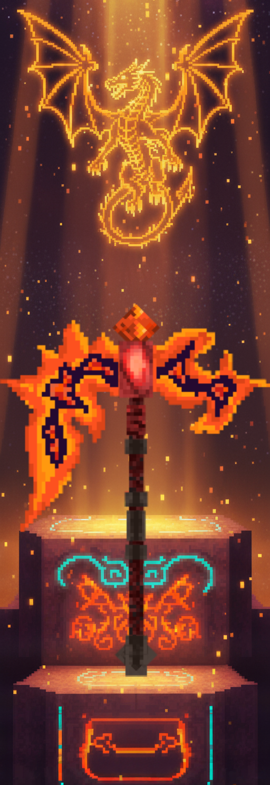
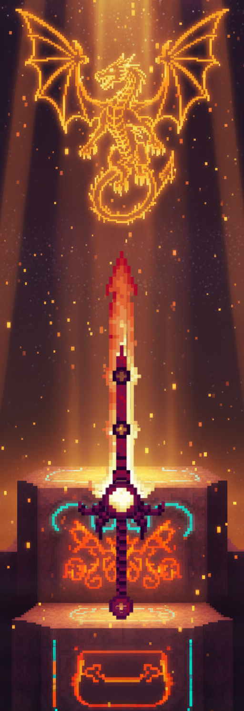
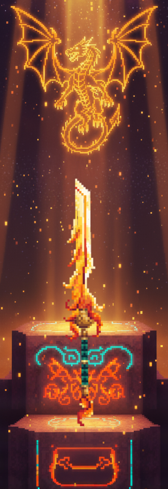

  

# ⚔️ Odyssey Swords

## Odyssey Swords é um mod para Minecraft que adiciona um arsenal de armas lendárias forjadas em poder arcano. Espadas, lanças e machados não são apenas visuais — cada arma possui habilidades únicas que tornam suas batalhas mais intensas, estratégicas e imersivas, transformando sua aventura em uma verdadeira jornada épica.

## 🖼️ Galeria Épica

  
  
  
  

## ⚔️ Recursos Principais

- ⚔️ **Espadas Lendárias** — cada uma com efeitos únicos e habilidades especiais.
- 🪓 **Machados Ancestrais** — poder bruto com golpes devastadores.
- 🪄 **Lanças Rúnicas** — alcance estendido e poder mágico em combate.
- 🌌 **Imersão Total** — partículas, sons e texturas personalizadas para uma experiência única.

## 📥 Instalação

1. Certifique-se de ter o **Minecraft Java Edition** instalado.
2. Baixe e instale o **Forge** compatível com a versão desejada:
   - [Forge 1.19.2](https://files.minecraftforge.net/net/minecraftforge/forge/index_1.19.2.html)
   - [Forge 1.20.1](https://files.minecraftforge.net/net/minecraftforge/forge/index_1.20.1.html)
3. Baixe o arquivo `.jar` do mod na aba **Releases** deste repositório.
4. Copie o `.jar` para a pasta:
   - **Windows:** `%appdata%/.minecraft/mods`
   - **Linux:** `~/.minecraft/mods`
   - **macOS:** `~/Library/Application Support/minecraft/mods`
5. Inicie o jogo com o perfil **Forge** e divirta-se!

> **Compatibilidade:** Odyssey Swords funciona em **Singleplayer** e **Multiplayer** (necessário que o servidor também tenha o mod instalado).

## 📊 Tabela de Compatibilidade

| Versão do Mod | Minecraft | Forge   | Status        |
|---------------|-----------|---------|---------------|
| v1.0.0        | 1.19.2    | 43.x.x  | ✅ Estável     |
| v1.0.0        | 1.20.1    | 47.x.x  | ✅ Estável     |

## 🤝 Contribuição

Quer ajudar a melhorar o **Odyssey Swords**? Sinta-se à vontade para contribuir!

- Abra **Issues** para relatar bugs ou sugerir novas funcionalidades.
- Faça **Fork** do repositório, crie uma **branch** e envie um **Pull Request**.
- Contribuições podem incluir código, traduções, texturas, ideias de balanceamento ou documentação.

### Guia rápido
1. Faça um fork do repositório.
2. Crie uma branch para sua modificação (`git checkout -b minha-feature`).
3. Commit suas alterações (`git commit -m "Descrição da feature"`).
4. Push para sua branch (`git push origin minha-feature`).
5. Abra um Pull Request aqui no GitHub.

## 🙏 Créditos
- Desenvolvimento: Leandro Kolosque
- Modelos e Texturas: Agradecimentos especiais ao **Eftann** pelo incrível trabalho visual e por me deixar utilizar os modelos para criar o mod.

> Toda ajuda é bem-vinda — este projeto é feito pela comunidade e para a comunidade!

## 📜 Licença
Este projeto é distribuído sob a licença **MIT**.  
Você pode usar, modificar e redistribuir o código, desde que mantenha os créditos originais.
